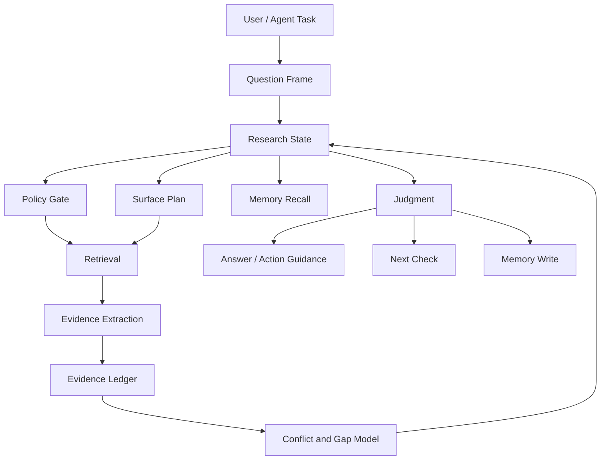
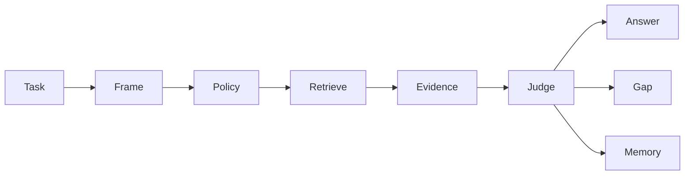

# Next-Generation Research Engine Thesis

Date: 2026-06-25
Status: revised strategic research paper
Scope: deeper diagnosis of why search, scraping, RAG, and report-generation remain insufficient; what human researchers actually do; where this thesis can overreach; and what `emet` should become if it wants to be useful rather than grand

## Plain-language summary

Most AI research tools are getting good at finding pages, reading pages, and writing cited reports.

That is real progress. It is not enough.

The missing layer is not "more search." The missing layer is disciplined research state: a durable, inspectable representation of the question, evidence, claims, contradictions, source policy, uncertainty, and next moves.

The danger for `emet` is that this thesis can easily become too grand. A small MCP research server should not pretend to be a complete artificial researcher. It should not build a cathedral of abstractions around every query. It should not compete with ChatGPT, Claude, or Gemini on polished report generation.

The sharper claim is narrower:

> `emet` should become a compact evidence discipline layer for agents, especially coding agents, when retrieval quality, source policy, version boundaries, and contradiction handling matter enough that ordinary search-plus-summary is unsafe.

That is still ambitious.

It is also much more defensible.

## Executive claim

The next useful layer in AI research is not a better page fetcher or a longer report writer.

It is an explicit separation between four jobs that current systems often blur:

- retrieval: finding candidate material
- evidence: turning material into inspectable claims with provenance
- judgment: deciding which claims matter, conflict, or remain unresolved
- memory: preserving validated state across turns, projects, and recurring topics

When these collapse into one final answer, the system can sound rigorous while remaining shallow.

When they are separated, an agent can ask better questions:

- What did we actually retrieve?
- Which claims did those sources support?
- Which claims contradicted each other?
- Which source policy was enforced before retrieval?
- What is still unknown?
- What should be checked next?
- What did we learn last time that remains valid?

That is the opportunity.

## Research base

Primary or close-to-primary sources checked for this revision:

- [OpenAI: Introducing deep research](https://openai.com/index/introducing-deep-research/)
- [OpenAI API: Deep research](https://developers.openai.com/api/docs/guides/deep-research)
- [OpenAI Help: Deep research in ChatGPT](https://help.openai.com/en/articles/10500283-deep-research-in-chatgpt)
- [OpenAI Codex web](https://developers.openai.com/codex/cloud)
- [OpenAI Codex CLI](https://developers.openai.com/codex/cli)
- [OpenAI Codex MCP docs](https://developers.openai.com/codex/mcp)
- [Anthropic: How we built our multi-agent research system](https://www.anthropic.com/engineering/multi-agent-research-system)
- [Claude API docs: Web search tool](https://platform.claude.com/docs/en/agents-and-tools/tool-use/web-search-tool)
- [Claude API docs: MCP connector](https://platform.claude.com/docs/en/agents-and-tools/mcp-connector)
- [Anthropic: Advanced tool use](https://www.anthropic.com/engineering/advanced-tool-use)
- [Google Gemini Deep Research overview](https://gemini.google/overview/deep-research/)
- [Google Cloud: Gemini Deep Research Agent](https://docs.cloud.google.com/gemini-enterprise-agent-platform/agents/use-deep-research)
- [Google Gemini CLI docs](https://developers.google.com/gemini-code-assist/docs/gemini-cli)
- [Google Gemini API coding-agent docs](https://ai.google.dev/gemini-api/docs/coding-agents)
- [Model Context Protocol specification](https://modelcontextprotocol.io/specification/2025-11-25)
- [MCP Tasks specification](https://modelcontextprotocol.io/specification/2025-11-25/basic/utilities/tasks)
- [Tavily](https://tavily.com/) and [Tavily agents docs](https://docs.tavily.com/agents)
- [Exa](https://exa.ai/) and [Exa search API docs](https://exa.ai/docs/reference/search-api-guide)
- [Brave Search MCP Server](https://github.com/brave/brave-search-mcp-server)
- [Firecrawl](https://www.firecrawl.dev/) and [Firecrawl MCP Server](https://github.com/firecrawl/firecrawl-mcp-server)
- [YouTube Data API quota cost](https://developers.google.com/youtube/v3/determine_quota_cost)
- [YouTube Data API quota audits](https://developers.google.com/youtube/v3/guides/quota_and_compliance_audits)
- [X API pricing](https://docs.x.com/x-api/getting-started/pricing)
- [Reddit Data API Terms](https://redditinc.com/policies/data-api-terms)
- [Pirolli and Card: The sensemaking process and leverage points for analyst technology](https://andymatuschak.org/files/papers/Pirolli%2C%20Card%20-%202005%20-%20The%20sensemaking%20process%20and%20leverage%20points%20for%20analyst%20technology%20as.pdf)
- [Russell, Stefik, Pirolli, Card: The cost structure of sensemaking](https://www.markstefik.com/wp-content/uploads/2014/04/1993-Cost-Structure-of-Sensemaking1.pdf)
- [Gary Klein: Data-Frame Theory](https://www.gary-klein.com/data-frame)

## The thesis under stress

The original thesis was directionally right: research tools often stop at search, scraping, summarization, and report generation.

But the thesis was too comfortable in three ways.

First, frontier vendors are closing the obvious gaps fast. OpenAI now describes deep research models that can use web search, file search, remote MCP servers, and code interpreter. Anthropic describes multi-agent research systems and tool discovery. Google describes managed deep research agents across web, custom sources, Workspace, MCP, uploaded files, and visualizations. Coding agents such as Codex and Gemini CLI now sit where developers actually work and can use MCP tools.

Second, generic web-data vendors are not static. Tavily, Exa, Brave, and Firecrawl already sell search, extraction, crawling, MCP compatibility, agent-ready context, and in some cases research workflows. A small project cannot win by saying it searches, fetches, extracts, cites, or works with MCP.

Third, evidence architecture can become self-indulgent. It is easy to draw an evidence graph and call it the future. It is harder to prove that the graph changes decisions, reduces wrong answers, improves agent behavior, or is worth the latency and complexity.

So the thesis survives only if it becomes stricter:

- do not compete on report polish
- do not compete on generic web search
- do not treat every query as a grand investigation
- do not invent a large architecture unless it removes a real failure mode
- do not call source policy "strict" until it is enforced before network, ranking, cache, and synthesis paths
- do not claim human-level research; claim better evidence discipline for agent workflows

## What search, scraping, and report generation fundamentally cannot solve

### Search returns candidates, not truth

Search is optimized for candidate discovery.

Even excellent search does not know whether a result is decisive, stale, promotional, contradicted, policy-allowed, or merely similar to the query.

This is not a defect in search. It is a boundary.

Search can tell the system where to look. It cannot by itself decide what kind of evidence would settle the question.

### Scraping returns text, not evidence

Scraping turns a page into extractable content.

That is useful, but a scraped document is still not an evidence object.

Evidence requires at least:

- source identity
- publication or modification date
- actor proximity to the claim
- claim extracted from the source
- the exact thing the claim supports
- the exact thing it contradicts
- the version or time boundary
- the policy under which it was allowed

A raw page, a markdown conversion, or a chunk is not enough.

### RAG often moves the bottleneck instead of removing it

Retrieval-augmented generation improves answer grounding by giving the model external context.

But a RAG pipeline can still fail in familiar ways:

- it retrieves relevant but non-decisive sources
- it overweights popular summaries over primary material
- it collapses contradictions into smooth prose
- it loses version boundaries
- it cites material that was useful for wording but weak for proof
- it has no durable memory of what was already ruled out

RAG is a powerful pattern. It is not a research methodology.

### Report generation creates closure too early

A cited report feels complete.

That feeling is dangerous.

A report is a communication artifact. It is not the research state itself.

When the report becomes the only durable output, the system loses:

- abandoned hypotheses
- rejected sources
- unresolved contradictions
- source-policy decisions
- search paths not taken
- confidence changes over time
- reasons why more search would not help

This matters especially for agents. An agent about to edit code does not only need a well-written answer. It needs to know whether the evidence is strong enough to act.

### The web is not a uniform database

The world is unevenly retrievable.

Docs, GitHub, papers, forums, video transcripts, social platforms, private workspaces, newsletters, Discord, Slack, and paywalled sources all have different access rules, incentives, freshness patterns, and failure modes.

Official platform constraints make this structural:

- X now describes usage-based API pricing and credits.
- Reddit's Data API Terms impose registration, permitted-use, fee, and restriction structures.
- YouTube charges quota units for API methods and requires audit processes for quota extensions.
- Google and OpenAI deep research products can combine first-party model capabilities with web, file, MCP, Workspace, and hosted integrations that a small open tool cannot simply replicate.

"Just scrape more" is not a strategy. It is often a policy, cost, reliability, or ethics problem.

## What a human researcher is actually doing

The core mistake in many AI research products is treating research as document processing.

Human researchers do process documents, but that is the visible part. The deeper work is sensemaking.

Pirolli and Card's analyst sensemaking model separates information foraging from sensemaking: analysts seek, filter, and extract information, then build schemas, hypotheses, and conclusions. Russell, Stefik, Pirolli, and Card emphasized that sensemaking involves choosing and changing representations to reduce cognitive cost. Klein's data-frame theory describes sensemaking as fitting data into explanatory frames and adapting frames around data.

For `emet`, the practical lesson is simple: a human researcher is not just collecting sources. They are continuously changing the representation of the problem.

### The cognitive jobs tools usually miss

A good researcher is doing at least nine things that most tools only approximate:

1. Framing the real question.

The user asks "Is this dependency safe?" The researcher hears several hidden questions: safe for what environment, against which threat model, at what version, under what maintenance expectations, with what alternatives?

2. Building an evidence diet.

The researcher decides which surfaces are worth the cost. Official docs may answer API contracts. Changelogs answer deltas. GitHub issues answer failure reality. Security advisories answer disclosed risk. Community reports answer field pain. Each source type has a job.

3. Tracking hypotheses.

The researcher keeps multiple possible answers alive before collapsing to one. "The tool is immature" and "the docs are stale but the implementation is stable" require different checks.

4. Distinguishing source proximity.

The researcher notices whether a claim comes from a maintainer, a vendor page, a changelog, a secondary blog, an SEO farm, an issue commenter, or a user repeating hearsay.

5. Noticing contradictions.

Contradiction is not noise. It is often the research object. If docs say one thing and maintainers say another in an issue, the answer is not the average of both.

6. Maintaining temporal discipline.

Many technical truths are versioned. A perfect answer for React 18 can be misleading for React 19. A migration guide may be correct before a minor release and wrong after it.

7. Deciding when more search is useful.

Humans stop when the marginal value of another source is low or when the remaining uncertainty must be resolved experimentally, not by more reading.

8. Preserving reusable state.

A researcher remembers that a package has weak docs but excellent release notes, that a maintainer's comments are authoritative, or that a previous investigation found a version boundary.

9. Translating evidence into action.

The final output is not just "what sources said." It is "what should we do, how confident are we, and what would change the recommendation?"

These jobs are exactly where a research engine can be useful. They are also where it can overreach.

## The sharper primitives: retrieval, evidence, judgment, memory

The architecture should be organized around four primitives, not around a long list of features.

### 1. Retrieval

Retrieval asks: what candidate material should we inspect?

Retrieval includes search, fetch, extraction, crawling, platform-specific collectors, and source routing.

Retrieval should not decide final authority. It should produce candidates and page bodies under explicit policy.

Hard rule:

- retrieval may expand coverage, but it must not bypass source policy

### 2. Evidence

Evidence asks: what claims did the material actually support?

Evidence is not the same as a source. One source can support many claims. One claim can require several sources. One source can be strong for one claim and weak for another.

An evidence item should carry:

- claim
- source URL or artifact identity
- source class
- actor proximity
- date and version context
- quoted or extracted support span where available
- policy identity
- confidence rationale

Hard rule:

- evidence must remain inspectable after the answer is written

### 3. Judgment

Judgment asks: what should we believe or do given the evidence?

This is where conflict, sufficiency, uncertainty, and actionability live.

Judgment should produce:

- supported claims
- contradicted claims
- unresolved claims
- confidence boundaries
- next best checks
- stopping rationale

Hard rule:

- judgment must not be hidden inside fluent prose

### 4. Memory

Memory asks: what should persist beyond this turn?

Memory is not a cache of answers. It is a selective record of validated research state.

Useful memory includes:

- trusted source classes for a topic
- known version boundaries
- recurring disputes
- resolved questions
- rejected weak sources
- prior user or project policy

Hard rule:

- memory must be policy-aware, version-aware, and safe to invalidate

## The architecture caricature

The ideal architecture is still useful as a caricature, but it should not be read as a mandate to build every box immediately.

The important idea is not the diagram.

The important idea is that the answer is downstream of research state, not a substitute for it.

## A less over-engineered target architecture

For `emet`, the right target is not a giant autonomous research operating system.

The right target is a small number of enforceable layers:

### 1. Policy before retrieval

All source constraints must become concrete before any provider, fetcher, redirect, cache lookup, ranking, or synthesis step can weaken them.

This includes:

- host allowlists
- path allowlists
- source type constraints
- authoritative-only requirements
- recency constraints
- version-sensitive mode
- private or internal address handling

If the product wants to be trusted, policy cannot be advisory.

### 2. Evidence ledger before final answer

The system should emit or internally maintain a compact evidence ledger:

- claim
- source
- source class
- support or contradiction
- date/version context
- confidence note

This is more important than a beautiful report.

### 3. Gap model before more search

The next retrieval step should be justified by a gap:

- missing primary source
- stale evidence
- unresolved version boundary
- contradiction between docs and implementation
- weak community-only signal
- insufficient field evidence

If no gap exists, the system should stop.

### 4. Memory only where it pays rent

Long-lived memory should be selective.

It should not remember every answer. It should remember durable research facts that improve future investigations:

- "This package's release notes are more reliable than its docs for migration details."
- "GitHub issues are the decisive source for this bug class."
- "This API changed behavior at version X."
- "This source policy was required by this project."

Memory is valuable only if it is safe, scoped, invalidatable, and inspectable.

## What `emet` is today

`emet` already points in the right direction, but the current repo audit shows the gap between aspiration and category claim.

### Strengths

`emet` has real advantages:

- MCP/Pi shape makes it composable inside agent workflows
- source policy thinking is more serious than many generic search tools
- domain packs and overlays point toward source-class semantics
- checkpoint/community work points toward iterative research
- ranking, coverage, and synthesis are separated enough to evolve
- the project already cares about authority, recency, version sensitivity, and citations

### Weaknesses

The audit also shows category-threatening weaknesses:

- source policy can be porous across fetch, provider, academic, and host/path paths
- cache identity can reuse results across policy or version boundaries
- ranking can blur authority semantics
- compatibility surfaces keep old and new flows alive
- checkpoint/community flow can behave like a parallel product path
- logs and telemetry need a stricter trust posture
- evidence state is still less central than final answer generation

These are not just bugs.

They are evidence that the product is not yet allowed to claim the strongest version of its strategy.

## Comparison against generic research tools

Generic research tools increasingly offer:

- web search
- page extraction
- crawling
- MCP servers
- report generation
- citations
- agent-ready context

Tavily describes itself as a web layer for agents with search, extraction, crawling, mapping, and cited research. Exa positions itself as search and context for AI agents. Brave's MCP server exposes web, local, image, video, news, LLM context, and summarization. Firecrawl sells search, scrape, map, crawl, and agent workflows for clean web data.

That means `emet` must not define itself by those capabilities.

It should define itself by stricter semantics:

- source constraints are contracts
- evidence is claim-level, not page-level
- contradictions are represented, not smoothed
- technical version boundaries are first-class
- cache and memory preserve policy identity
- outputs are designed for agents deciding whether to act

If `emet` cannot make those things real, the generic tools are probably good enough.

## Comparison against first-party deep research

OpenAI, Anthropic, and Google are strategically dangerous because they combine strong models, first-party UX, proprietary integrations, and huge distribution.

OpenAI says deep research can find, analyze, and synthesize hundreds of sources, and the API version supports web search, file search, remote MCP servers, and code interpreter. ChatGPT deep research produces structured reports with citations, source sections, activity history, and export formats.

Anthropic describes Claude Research as a multi-agent system across web, Workspace, and integrations, and its API surface includes web search, MCP connector behavior, and dynamic tool discovery.

Google describes Gemini Deep Research as a personal or managed research agent across web, Workspace, custom sources, uploaded files, MCP, visualizations, and long-running workflows. Gemini CLI also gives developers a terminal agent with built-in tools and local or remote MCP servers.

`emet` should not pretend these are shallow incumbents.

They are strong.

The opening is not that they cannot research. The opening is that their research state is mostly embedded in their product surface, model behavior, vendor policy, and UX.

`emet` can be useful if it becomes:

- host-agnostic
- inspectable
- source-policy explicit
- technical-domain specialized
- easy for coding agents to call
- small enough to trust

That is a different product.

## Comparison against coding-agent plus tools

The coding-agent environment is both the best channel and the most serious substitute.

Codex can read, edit, and run code locally or in the cloud. Gemini CLI uses a reason-and-act loop with built-in tools and MCP servers for bug fixes, features, and test improvements. Claude and other coding tools increasingly expose web search, connectors, and dynamic tool discovery.

In that world, `emet` is not the main actor.

The coding agent is the main actor.

This is not a demotion. It is the correct role.

`emet` should be the tool the agent calls when a task crosses from "I need a fact" into "I need evidence before changing code."

Examples:

- package migration with stale docs risk
- framework upgrade with version-specific behavior
- security advisory status
- dependency selection under production constraints
- changelog interpretation
- docs vs GitHub issue contradiction
- deprecation or breaking-change research
- API behavior whose official contract and field behavior differ

For simple facts, the host's built-in search may be enough.

For high-friction technical judgment, `emet` can matter.

## Where this thesis could be wrong

### It may overestimate how much users care about evidence state

Many users do not want inspectable evidence. They want the answer.

Even developers often prefer a plausible recommendation over a research ledger unless the cost of being wrong is immediate.

If the product exposes evidence state in a way that feels heavy, it will lose to simpler workflows.

### It may underestimate frontier model progress

Model vendors can absorb many visible features:

- better source selection
- stronger citations
- activity trails
- connectors
- MCP support
- file search
- report export
- long-running tasks
- structured intermediate state

If first-party tools expose enough inspectable state and policy control, `emet`'s independent lane narrows.

### It may mistake architecture for product value

An evidence graph is not valuable because it exists.

It is valuable only if it changes behavior:

- catches a wrong source
- blocks a policy bypass
- reveals a contradiction
- prevents stale cache reuse
- guides a better next check
- helps an agent avoid a bad code change

If the graph does not do those things, it is ceremony.

### It may make simple tasks worse

Most research requests are not worth a full research-state loop.

The product needs an escalation model:

- simple search/fetch for simple tasks
- evidence ledger for medium-risk tasks
- contradiction/gap loop for high-risk tasks
- memory only for repeated or policy-sensitive topics

Without this, `emet` becomes slow and fussy.

### It may rely on inaccessible sources

Many of the most valuable signals live in places that are hard to access legally, reliably, or cheaply.

Private Slack, Discord, paywalled newsletters, platform-constrained social data, and internal docs cannot be treated as guaranteed surfaces.

The architecture must degrade honestly.

### It may fail because trust is unforgiving

A generic search tool can be somewhat wrong and remain useful.

An evidence engine gets judged by its guarantees.

If source policy, cache identity, and provenance are unreliable, the product's premium claim collapses.

## What this implies for `emet`

### Product law 1: policy is not a preference

If a user says only these hosts, source types, dates, or authoritative classes are allowed, the engine must enforce that before retrieval and preserve it through cache, ranking, synthesis, and memory.

### Product law 2: evidence must be inspectable

Every important answer claim should be traceable to evidence objects, not merely to a list of links.

### Product law 3: contradiction is signal

When sources disagree, the system should show the disagreement, classify it, and either resolve it or mark it unresolved.

### Product law 4: technical time matters

Version, release, date, and deprecation boundaries should be part of the state model, not afterthoughts in prose.

### Product law 5: memory must be scoped and humble

Memory should remember durable research structure, not stale final answers. It must be scoped by project, policy, source set, version, and time.

### Product law 6: stop early when search cannot help

Sometimes the next step is not another query. It is running a test, inspecting code, asking the user for a constraint, or saying the evidence is insufficient.

## Final architecture posture

The right architecture is not "build a huge research brain."

The right architecture is:

- a strict policy gate
- a surface-aware retriever
- a claim-level evidence ledger
- a conflict and gap model
- a cautious answer composer
- a scoped memory layer

Everything else should earn its place.

In caricature:

This is deliberately smaller than the earlier diagram.

It is also more useful.

## Final thesis

The winning next-generation research capability is not the tool that reads the most pages or writes the longest report.

It is the tool that helps an agent preserve the difference between:

- what was found
- what was evidenced
- what was judged
- what was remembered

For broad knowledge work, first-party deep research products may win.

For generic web access, Tavily, Exa, Brave, Firecrawl, and built-in search may be enough.

For coding-agent work where a bad source can lead to a bad edit, `emet` has a credible opening.

But only if it becomes smaller and stricter:

- not a search product
- not a report product
- not an everything-research agent
- an evidence discipline layer for technical agents

That is the thesis worth building toward.
